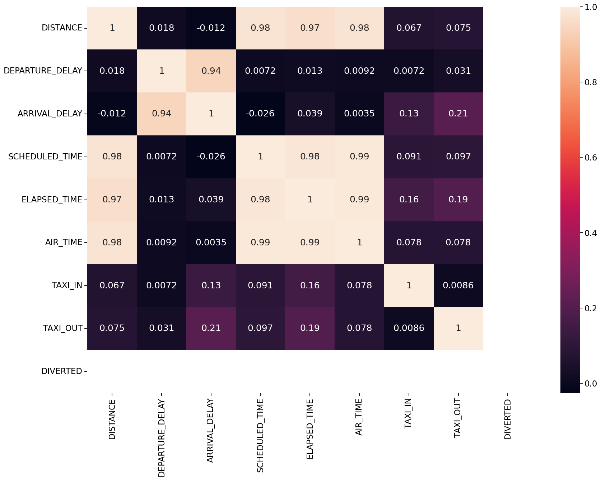

# Flight Delay & Cancellation Prediction (EDA + Model Benchmarking)

This project analyzes U.S. flight operations data to understand **delay patterns** and benchmark multiple machine learning models for predicting **arrival delay (minutes)**. It includes the full workflow: data loading, cleaning, exploratory analysis, feature preparation, model training, and evaluation across several regressors.

---

## Dataset

The dataset is hosted externally due to file size limits.

**Download link (Google Drive):**  
https://drive.google.com/file/d/1UrVg6Ts7jWNgCnGWithIRtN6jfmNg54w/view?usp=sharing

It contains three CSV files:
- `flights.csv` — flight-level records (schedule, airports, delay fields, etc.)
- `airports.csv` — airport metadata
- `airlines.csv` — airline metadata

> Note: The dataset is not committed to this repository because it exceeds GitHub size limits.

---

## Project Goals

1. Perform exploratory data analysis (EDA) to answer:
   - What does the distribution of arrival delays look like?
   - Which airlines / routes show higher average delay behavior?
   - Which numeric variables correlate most with delays?
2. Build a supervised learning setup to predict:
   - **Target:** `ARRIVAL_DELAY` (minutes)
3. Benchmark multiple regression models and compare:
   - MAE, RMSE, R² on a held-out test split

---

## What’s Included

- **EDA:** trends, distributions, and grouped insights (airlines, airports/routes)
- **Preprocessing:** encoding categorical variables + scaling for modeling
- **Model Benchmarking:** comparison of multiple regressors including:
  - Linear / Ridge / Lasso
  - Decision Tree / Random Forest
  - Boosted and Bagged variants

---

## Results Preview (Add Screenshots)

Create an `assets/` folder and add your exported plots using the filenames below, then they will render automatically here.

### Data overview (shape + missingness)

### Arrival delay distribution

### Airline / route delay insights
  

### Correlation analysis

### Model benchmarking

### Best model summary

---

## How to Run Locally

### 1) Download & extract the dataset
1. Download from Google Drive:
   https://drive.google.com/file/d/1UrVg6Ts7jWNgCnGWithIRtN6jfmNg54w/view?usp=sharing
2. Extract the files and confirm you have:
   - `flights.csv`
   - `airports.csv`
   - `airlines.csv`

### 2) Place files in the project directory
Create a folder named `data/` in the repo root and move the CSVs into it:
